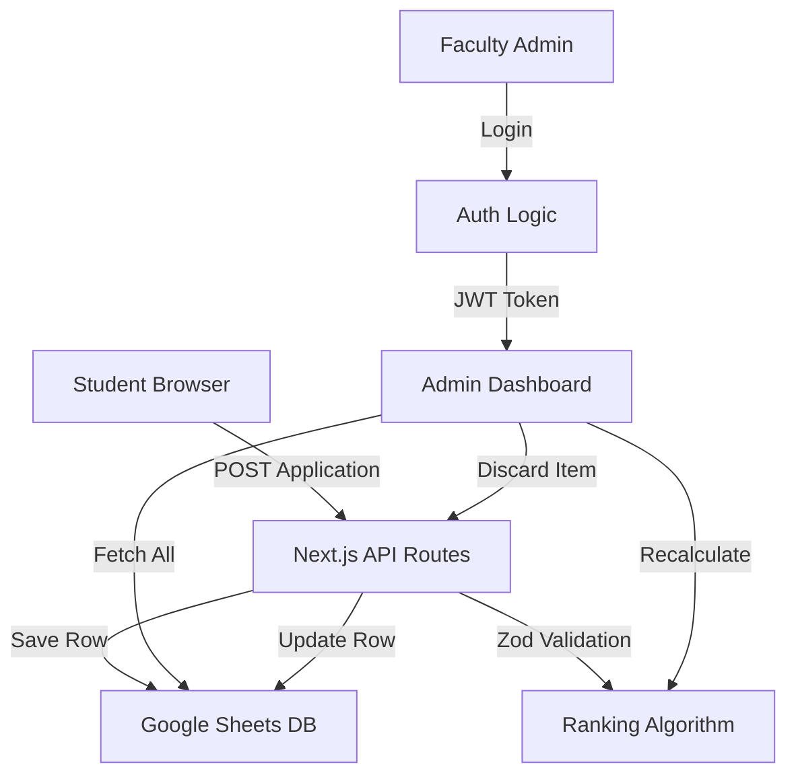

# System Architecture & File Connections

This document describes how the files in the **BO-Student** project connect and interact—the "0 to everything" map.

## 1. High-Level Data Flow

## 2. Directory & File Descriptions

### `src/app/` (The Routing Layer)
- **`page.tsx`**: The entry point. It contains the marketing content (Hero, How It Works) and links to the login/apply pages.
- **`apply/page.tsx`**: Hosts the `FormSteps.tsx` component. This is where students spend 10–20 minutes filling their profiles.
- **`admin/page.tsx`**: A protected page that checks for an `ADMIN_TOKEN` cookie. If valid, it renders `AdminClient.tsx`.
- **`[reg_no]/page.tsx`**: A dynamic route (e.g., `/RA221...`). It fetches data from Google Sheets for a specific registration number and displays it as a professional portfolio.

### `src/lib/` (The Logic Layer)
- **`ranking.ts`**: **The Brain.** This file contains every weightage constant (like `CGPA: 18`) and every scoring function. It is used by both the Student form (to show preview scores) and the Admin dashboard.
- **`googleSheets.ts`**: **The Connector.** It contains all the "CRUD" logic (Create, Read, Update, Delete) for the spreadsheet. It handles connection pooling, retries, and data transformations.
- **`schemas.ts`**: **The Gatekeeper.** Defines the strict structure of an application. If a student tries to enter a CGPA of 11, this file stops them.
- **`types.ts`**: The source of truth for TypeScript interfaces. It ensures that throughout the app, a "Student" object always has the same fields.
- **`adminAuth.ts`**: Handles the security of the faculty dashboard using cryptographically signed tokens.

### `src/components/` (The UI Layer)
- **`FormSteps.tsx`**: A massive component managing the 20-step input process. It uses "State" to remember what the student typed in Step 1 while they are in Step 15.
- **`Navbar.tsx`**: The persistent navigation bar.
- **`ComparisonModal.tsx`**: A specialized UI that appears when an admin wants to see two students' data side-by-side.

## 3. How Files Connect (Example: Submitting an Application)

1.  **UI**: User clicks "Submit" in `FormSteps.tsx`.
2.  **Validation**: `FormSteps.tsx` uses `applicationSchema` from `schemas.ts` to check every field.
3.  **API Call**: The browser sends the data to `/api/admin` (Route Handler).
4.  **Database**: The API route calls `appendStudent()` from `googleSheets.ts`.
5.  **Persistence**: `googleSheets.ts` uses the `GOOGLE_PRIVATE_KEY` to talk to Google's servers and adds a new row.

## 4. How Files Connect (Example: Admin Discarding an Item)

1.  **Action**: Faculty clicks "Discard" on an internship in `AdminClient.tsx`.
2.  **State**: `AdminClient.tsx` updates its local list of "discarded items."
3.  **Real-time Math**: `AdminClient.tsx` calls `calculateScore()` from `ranking.ts` with the new discard list. The student's rank on the screen changes instantly.
4.  **Save**: Faculty clicks "Save Changes." This hits `/api/admin/evaluate/route.ts`.
5.  **Update**: The API calls `updateStudentEvaluation()` in `googleSheets.ts` to permanently save the discard status to the spreadsheet.
